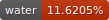

# donkey


- 
- 
- 
- 
- 
- 
- 
- 
- 
- 
- 

Grab tools

```sh
git submodule update --init --recursive
```

Drop in `US` as `baserom.us.z64` (sha1sum: `cf806ff2603640a748fca5026ded28802f1f4a50`)

To extract and build everything

```sh
make
```

Build a level or core code section separately (from base of repo): 


```sh
make <module_id>
```

where the following are supported values of `<module_id>`
- `global_asm`
- `menu`
- `multiplayer`
- `minecart`
- `bonus`
- `race`
- `water`
- `boss`
- `arcade`
- `jetpac`

## Prerequisites

Ubuntu 18.04 or higher.

```sh
apt-get update && \
  apt-get install -y \
    binutils-mips-linux-gnu \
    build-essential \
    gcc-mips-linux-gnu \
    less \
    libglib2.0 \
    python3 \
    python3-pip \
    unzip \
    wget \
    libssl-dev

python3 -m pip install \
    capstone pyyaml pylibyaml pycparser \
    colorama ansiwrap watchdog python-Levenshtein cxxfilt \
    python-ranges \
    pypng anybadge
```

## Other versions

Drop in `kiosk`, `jp`, or `pal` as `baserom.<version>.z64` e.g. `baserom.kiosk.z64`

```sh
make VERSION=kiosk
```
