# donkey


- 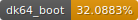 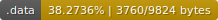 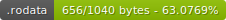
- 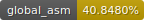 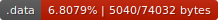 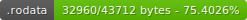
- 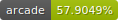 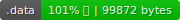 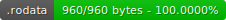
- 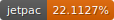 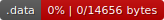 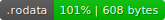
- 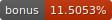 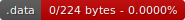 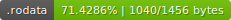
- 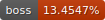 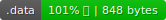 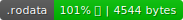
-  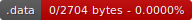 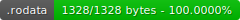
- 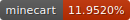 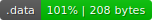 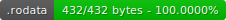
-  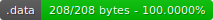 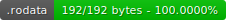
- 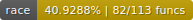 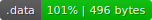 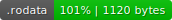
- 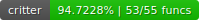 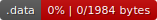 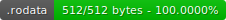

## Setup

Grab tools

```sh
git submodule update --init --recursive
```

Drop in `US` as `baserom.us.z64` (sha1sum: `cf806ff2603640a748fca5026ded28802f1f4a50`)

To extract and build the ROM use one of the installation options listed below.

### Docker

A Dockerfile is provided that is based on Ubuntu can be used for development and building the ROM.

Build the Docker image:

```sh
docker build -t dk64 .
```

Then the ROM can be built with Docker using `make`

```sh
docker run --rm -v ${PWD}:/dk64 --user $UID:$GID dk64 make -j8
```

This command will start the docker container, build everything, then exit.

See the [Makefile](./Makefile) for a full list of options and supported arguments, e.g. `make clean`.

---

Other tools and scripts can be used with the Docker container as well.

For example, running a script from the tools folder:

```sh
docker run --rm -v ${PWD}:/dk64 --user $UID:$GID dk64 python tools/generate_decompressed_rom.py
```

### Ubuntu

Ubuntu 18.04 or higher.

```sh
sudo apt-get update && \
  sudo apt-get install -y \
    binutils-mips-linux-gnu \
    build-essential \
    gcc-mips-linux-gnu \
    less \
    libglib2.0 \
    python3 \
    python3-pip \
    unzip \
    wget \
    libssl-dev \
    vbindiff

sudo python3 -m pip install \
    pyyaml pylibyaml pycparser \
    colorama ansiwrap watchdog python-Levenshtein cxxfilt \
    python-ranges \
    pypng anybadge \
    tqdm intervaltree n64img spimdisasm
```

Then to build everything just run make:

```sh
make -j
```

The ROM will now be built.
